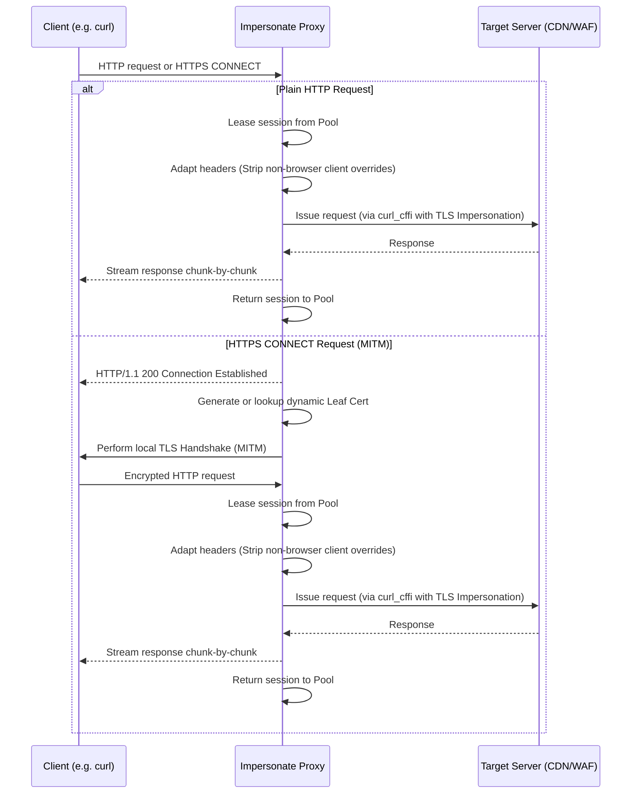

# How It Works (Architecture & Workflow)

`impersonate-proxy` acts as a transparent intermediary that sits between client applications (like `curl`, `ffmpeg`, or Python HTTP clients) and the destination servers. It prevents fingerprint blocking by aligning the client's TLS handshake fingerprint with its HTTP headers.

---

## 1. Request Interception Workflow

Below is a diagram illustrating how the proxy handles client requests:



---

## 2. Dynamic Certificate Generation (MITM)

For HTTPS requests, the proxy establishes a Man-in-the-Middle (MITM) state to inspect headers and decrypt the client payload.

1. **Root CA Generation**: At startup, if no CA files are found, the proxy creates a root CA private key and self-signed certificate using fast **ECDSA SECP256R1 (P-256)** keys.
2. **Leaf Certificate Issuance**:
    - For each requested domain, the proxy generates a leaf certificate signed by the root CA.
    - **Optimization**: To avoid CPU bottleneck during RSA key creation, the proxy generates an ECDSA P-256 leaf certificate and reuses a single static leaf key (`_LEAF_KEY`) globally across all generated certs. This reduces leaf cert generation times to `<1ms`.
3. **Certificate Caching**: Generated `ssl.SSLContext` structures are stored in a thread-safe cache (`_HOST_CERT_CACHE`). If the cache grows beyond 256 hosts, the least recently used (LRU) context is evicted automatically.

---

## 3. Keep-Alive Connection & Session Pooling

Under load (such as bursts of ~100 concurrent requests), initiating new `curl_cffi` sessions is resource-intensive due to easy handle allocation and TLS handshakes.

- **Global Session Pool**: The proxy manages a queue-based `_SESSION_POOL` containing reusable `curl_cffi` sessions (capped at 32).
- **Upstream Keep-Alive**: Reusing sessions maintains active TCP connections to target hosts. Subsequent requests to the same target domain completely bypass DNS resolving and TCP/TLS handshake steps.
- **Resource Leasing**: When a request starts, a session is leased from the pool. The proxy wraps the response's `close()` method so that the session is automatically returned to the pool only when the response stream has been fully consumed or closed by the client.

---

## 4. Header Modes

This is one of the most important — and often overlooked — mechanisms in the proxy. It is what makes the difference between bypassing a WAF and getting blocked.

### Why it matters

WAF/CDN systems such as Cloudflare, Akamai, and Imperva perform **two independent fingerprinting checks**:

1. **TLS fingerprint** (JA3/JA4): based on the SSL ClientHello — cipher suites, extensions, elliptic curves, etc.
2. **HTTP header fingerprint**: based on the presence and ordering of HTTP headers — `User-Agent`, `Accept`, `Accept-Language`, `Accept-Encoding`, `Sec-Fetch-*`, and Chrome Client Hints (`Sec-Ch-Ua-*`).

`curl_cffi` handles the TLS side flawlessly by using libcurl patched with browser fingerprints. However, if you send a `curl/7.81.0` User-Agent or omit `Sec-Fetch-Dest` headers, the WAF sees a TLS handshake that says "Chrome 120" and headers that say "curl" — an immediate mismatch that triggers a block.

The proxy therefore exposes **two mutually-exclusive header modes** plus an orthogonal **client-leak stripping** flag. The key insight: **curl_cffi already injects the full current browser header set** when `default_headers=True` (the project's default). The proxy's job is to *get out of curl_cffi's way* — strip client-supplied browser-shape headers that would override curl_cffi's defaults, and let curl_cffi own the rest.

### The two header modes

| Mode | Flag | Env var | Behaviour |
|------|------|---------|-----------|
| **cffi-defaults** (default) | `--cffi-defaults` | `IMPERSONATE_PROXY_HEADER_MODE=cffi-defaults` | **Strip** browser-shape headers (`User-Agent`, `Sec-Ch-Ua-*`, `Accept-Encoding`, `Priority`, `TE`, `Upgrade-Insecure-Requests`, `Sec-Fetch-User`) from the client so curl_cffi injects the correct current browser values; **drop** bot-tell headers (`Cache-Control`, `DNT`, `Connection`); **preserve** request-specific headers (`Cookie`, `Authorization`, `Referer`, `Content-Type`, `If-*`, `Range`, `Host`) and shape-dependent headers (`Accept`, `Sec-Fetch-Dest/Mode/Site`, real `Accept-Language`). |
| **passthrough** | `--passthrough-headers` | `IMPERSONATE_PROXY_HEADER_MODE=passthrough` | Forward client headers untouched (curl_cffi only manages TLS). You are fully responsible for header/TLS consistency. For advanced users. |

### `--strip-client-leak-headers` (orthogonal)

Drops middlebox-chain and tracing headers that a client may realistically forward and that betray the request as coming through a proxy or non-browser client. Combinable with any header mode:

- `X-Forwarded-For`, `X-Forwarded-Host`, `X-Forwarded-Proto`, `X-Forwarded-Server`
- `Forwarded` (RFC 7239)
- `Via`
- `X-Request-ID`, `X-Correlation-ID`

Env var: `IMPERSONATE_PROXY_STRIP_CLIENT_LEAK_HEADERS=true`.

**CDN-ingress headers are *not* stripped.** Headers such as `X-Real-IP`, `True-Client-IP`, `CF-Connecting-IP`, `X-Cluster-Client-IP`, and `Fastly-Client-IP` are normally added by a CDN/edge layer on ingress to the CDN — they should never appear in a client request. If one is present, it indicates a misconfiguration (or replay of captured traffic); the proxy **logs a warning and forwards it unchanged** so the misconfig is visible to the operator rather than silently swallowed.

### How cffi-defaults works

curl_cffi (with `default_headers=True`, the project's default) automatically injects the **complete current browser header set** from its impersonation profile — `User-Agent`, `Sec-Ch-Ua-*`, `Sec-Fetch-*`, `Accept`, `Accept-Encoding`, `Accept-Language`, `Priority`, `TE` — matching the [curl-impersonate captured signatures](https://github.com/lexiforest/curl-impersonate/tree/main/tests/signatures) for `chrome146` / `firefox147` exactly.

**Critical behaviour**: client-supplied headers OVERRIDE curl_cffi's defaults. So forwarding a client's `Accept: */*` or `Accept-Encoding: gzip, deflate` *silently breaks* impersonation — curl_cffi cannot fix it.

`_cffi_defaults_headers()` therefore:

1. **Strips** browser-shape headers the client should not own (`User-Agent`, `Sec-Ch-Ua`, `Sec-Ch-Ua-Mobile`, `Sec-Ch-Ua-Platform`, `Accept-Encoding`, `Upgrade-Insecure-Requests`, `Sec-Fetch-User`, `Priority`, `TE`) so curl_cffi's profile defaults shine through.
2. **Drops** bot-tell headers (`Cache-Control`, `DNT`, `Connection` — the last with a warning because curl_cffi manages HTTP/2 connection state itself).
3. **Strips** `Accept-Language` only when the client sent the literal `*` (a bot tell); real values like `en-US,en;q=0.9` are preserved.
4. **Preserves** everything else: request-specific headers (`Host`, `Cookie`, `Authorization`, `Referer`, `Origin`, `Content-Type`, `Content-Length`, `If-Match`, `If-None-Match`, `If-Modified-Since`, `If-Unmodified-Since`, `Range`) and shape-dependent headers curl_cffi cannot infer — `Accept` (nav vs XHR), `Sec-Fetch-Dest/Mode/Site`. A non-browser XHR client (e.g. httpx) correctly sends `Sec-Fetch-Mode: cors` on its XHR requests; preserving it keeps the request XHR-shaped. Forcing curl_cffi's nav-style defaults onto an XHR request would itself be a bot tell.

The Chrome and Firefox header sets curl_cffi injects are sourced from the [curl-impersonate signature files](https://github.com/lexiforest/curl-impersonate/tree/main/tests/signatures) and track the latest default profiles (`chrome146`, `firefox147` as of curl_cffi >= 0.7). The proxy no longer hardcodes them.

### Choosing a mode

**cffi-defaults (default)** — best for almost all clients, including **non-browser httpx-style clients**. Such a client sends `Accept-Encoding: gzip, deflate` (no `br`/`zstd`), `Cache-Control: no-cache`, `DNT: 1`, and a `python-httpx` User-Agent. cffi-defaults strips all of those and lets curl_cffi inject the correct Chrome/Firefox equivalents, while preserving the client's `Accept: */*` and `Sec-Fetch-Mode: cors` so the request keeps its XHR shape.

```bash
# Recommended configuration for non-browser clients
impersonate-proxy --cffi-defaults --strip-client-leak-headers
```

```bash
# Or via env vars (cffi-defaults is the default, shown for completeness)
IMPERSONATE_PROXY_HEADER_MODE=cffi-defaults \
IMPERSONATE_PROXY_STRIP_CLIENT_LEAK_HEADERS=true \
impersonate-proxy
```

**passthrough** — for users who want full manual control. The proxy only handles TLS; you must ensure your client's HTTP headers are consistent with the impersonated TLS profile.

!!! warning "passthrough trade-offs"
    With `--passthrough-headers`, no header sanitisation happens. If your client sends a `python-httpx` User-Agent or omits `Sec-Fetch-*`, WAFs will block the request despite the impersonated TLS handshake.

### Passing your own headers

Custom `X-*` headers, `Authorization`, `Cookie`, `Referer`, `Origin`, `Content-Type`, `If-*`, and `Range` are **preserved by both modes**. To set a custom `User-Agent` that survives the proxy, use `--passthrough-headers`:

```bash
impersonate-proxy --passthrough-headers
curl -x http://127.0.0.1:8899 -H "User-Agent: MyApp/2.0" https://example.com
```

With `--cffi-defaults` (default), the User-Agent is always stripped so curl_cffi injects the impersonated profile's browser UA.

---

## 5. Sensitive Header Redaction in Logs

The proxy redacts sensitive headers (e.g. `Authorization`, `Cookie`, `X-Api-Key`) from log output by default. Full header values are only logged when `--debug` mode is active.
